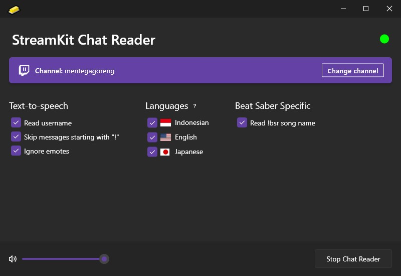

# 🧈 StreamKit Chat Reader 🧈

    

**This app is still in early stage.**

StreamKit Chat Reader is a free Twitch chat reader (text-to-speech) app that supports Indonesian, English, and Japanese simultaneously. StreamKit automatically detects the language of each chat message and read with the appropriate TTS.

StreamKit is designed for my streaming use cases ([https://twitch.tv/mentegagoreng](https://twitch.tv/mentegagoreng)), therefore some of the features will be tailored towards my needs, such as Beat Saber specific reading.

Feel free to suggest feature or report bug at the [Issues](https://github.com/mentegago/streamkit/issues) page or if you're a developer too and want to improve StreamKit, [submit a pull request](https://github.com/mentegago/streamkit/pulls).

If you're a streamer and need support for another language, please also submit in [Issues](https://github.com/mentegago/streamkit/issues). The currently supported languages (Indonesian, English, and Japanese) are based on my audiences.

## Usage
Download the latest version at [the release page](https://github.com/mentegago/streamkit/releases/latest). Download the zip file (**be aware to download "StreamKit" archive, not the "Source Code" archive!**), extract, and run `streamkit_tts.exe`. Follow the instruction in the app.

## Building
This app is written with [Flutter on Desktop](https://flutter.dev/multi-platform/desktop). You'll need **Flutter** SDK to be installed as well as everything [required to build a Flutter Windows app](https://docs.flutter.dev/desktop#additional-windows-requirements). 

This app has not been tested to run on macOS or Linux, however, the libraries used in this project are all crossplatform, so I don't think there should be any issue building for other platforms.

## Credits
App icon is butter emoji from Twemoji.
Copyright 2020 Twitter, Inc and other contributors
Graphics licensed under CC-BY 4.0: https://creativecommons.org/licenses/by/4.0/
